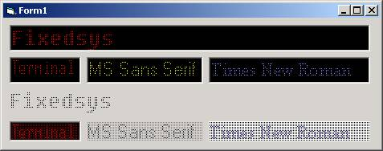



## LEDControl

### Description

LED Control without API (PSET & POINT only)
 
### More Info
 

             |
---                |---
**Submitted On**   |2001-08-18 22:37:50
**By**             |[Benedikt Huebschen](https://github.com/Planet-Source-Code/PSCIndex/blob/master/ByAuthor/benedikt-huebschen.md)
**Level**          |Advanced
**User Rating**    |4.8 (24 globes from 5 users)
**Compatibility**  |VB 5\.0, VB 6\.0
**Category**       |[Custom Controls/ Forms/  Menus](https://github.com/Planet-Source-Code/PSCIndex/blob/master/ByCategory/custom-controls-forms-menus__1-4.md)
**World**          |[Visual Basic](https://github.com/Planet-Source-Code/PSCIndex/blob/master/ByWorld/visual-basic.md)
**Archive File**   |[LEDControl249028182001\.zip](https://github.com/Planet-Source-Code/benedikt-huebschen-ledcontrol__1-26353/archive/master.zip)

### API Declarations

(none)

